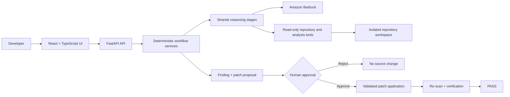

# Article 50 AutoDisclosure

> **Your AI feature shouldn't reach users without telling them it's AI.**

Article 50 AutoDisclosure is an autonomous software engineering agent that analyzes AI applications
before release, identifies missing AI transparency disclosures, generates a minimal remediation,
requires human approval, applies the approved fix, and verifies the result.

Built with the Strands Agents SDK and Amazon Bedrock for the AWS Agents for Humans Hackathon.

## Demo

The controlled demo shows the complete release-readiness loop without requiring AWS credentials or
network access:

```text
GitHub repository or controlled fixture
                 ↓
Repository analysis → AI usage detection → user-facing interaction reconstruction
                 ↓
Article 50 transparency analysis → ACTION REQUIRED
                 ↓
Remediation proposal → exact diff → human approval
                 ↓
Apply patch → re-scan affected interaction → verification → PASS
```

Start both applications, open `http://localhost:5173`, select **Try Demo Repository**, and then select
**Analyze Repository**. The demo copies a fresh React/FastAPI AI chat fixture into an isolated workspace
for every run, so another recording take can start from a clean state.

The fixture deliberately begins without an AI disclosure. It uses deterministic model responses for a
reliable presentation while exercising the real scan, evidence, patch validation, approval, application,
rollback, and verification services. The interface labels this run as **Demo repository**. Normal public
GitHub scans use the configured Amazon Bedrock model.

See [the 4-minute demo script](docs/demo-script.md) and the
[screenshot capture guide](docs/screenshots/README.md).

## Problem

AI capabilities can enter an application through chatbots, assistants, recommendation systems, and
generated summaries. A team may integrate the model correctly while forgetting to tell people that the
experience is powered by AI.

A dependency scanner can find an AI SDK, but it cannot by itself establish that a person directly
interacts with the model or that the relevant interface contains a clear disclosure. Article 50
AutoDisclosure catches that transparency gap before release.

## Solution

The agent analyzes the repository, not just its dependency manifests. It reconstructs the path from a
user-facing interface, through the application API and backend handler, to an AI provider. It then
inspects the UI associated with that path and produces an evidence-backed Article 50 readiness finding.

If remediation is appropriate, the system proposes a minimal patch. A developer reviews the exact diff
and explicitly approves or rejects it. Only an approved patch can be applied; the same affected
interaction is then analyzed again to verify the result.

This is not only:

```text
AI dependency detected → warning
```

It is:

```text
AI dependency → application-flow reconstruction → user-facing interaction detection
→ evidence-backed transparency analysis → remediation → human approval
→ bounded code modification → verification
```

## How it works

1. Validate and shallow-clone a public GitHub repository into an isolated workspace.
2. Inspect its structure, languages, frameworks, and likely AI integrations.
3. Detect AI provider signals, routes, endpoint callers, backend links, and model invocations.
4. Reconstruct evidence-backed frontend-to-provider interaction flows.
5. Inspect the relevant rendered UI for an explicit AI transparency disclosure.
6. Produce `PASS`, `ACTION_REQUIRED`, or `NEEDS_REVIEW` with verified source evidence.
7. Generate a one-file, bounded remediation proposal when a finding is safely remediable.
8. Wait for the developer to approve or reject the exact unified diff.
9. Revalidate and apply only an approved patch inside the retained workspace.
10. Re-scan the affected interaction and report whether it moved to `PASS`.

Findings include affected files, line references, canonical code snippets, the reconstructed AI
interaction, disclosure evidence, an explanation, and evidence-confidence. Model-proposed evidence is
re-opened and checked against the real source before it reaches the API.

## Architecture



The scan service orchestrates sequential Strands reasoning stages for repository investigation, AI
interaction reconstruction, Article 50 analysis, and remediation planning. These stages receive bounded
tools; they do not receive a shell or a repository write primitive.

Deterministic services own URL validation, workspace isolation, source-evidence validation, readiness
guardrails, diff parsing, path checks, patch-size limits, state transitions, snapshots, application,
rollback, and verification. This separates agent reasoning from the safety controls that authorize and
perform a source mutation.

See [the detailed architecture and trust boundaries](docs/architecture.md).

## Why Strands

The Strands Agents SDK provides the reasoning and tool-orchestration layer for questions that require
repository context: understanding an unfamiliar architecture, tracing a user-facing flow across files,
assessing disclosure evidence, and planning a minimal remediation. Each stage returns validated Pydantic
structured output.

Strands is not used to bypass deterministic controls. Agent output is treated as a proposal: source
evidence and patches are independently checked by application code before they are accepted.

## Amazon Bedrock

Amazon Bedrock provides the foundation model used by the Strands stages for live public-repository
analysis and remediation generation. The default is Claude Sonnet 4.6 through the global inference
profile:

```env
AWS_REGION=us-east-1
BEDROCK_MODEL_ID=global.anthropic.claude-sonnet-4-6
```

The model identifier and region are configurable in `backend/.env`. The application creates a boto3
session without embedded credentials and therefore uses the standard AWS credential provider chain.
Do not place AWS access keys in any project `.env` file.

The controlled demo mode does not call Amazon Bedrock; it is a development and presentation fallback,
not the primary live architecture.

Release validation on 2026-09-13 reached the live Bedrock path, but the configured model was reported as
unavailable. Live model validation therefore remains pending external AWS model access; the controlled
demo and all local safety paths are fully validated.

## Human-in-the-loop safety

The agent never silently modifies source code.

1. A finding is generated from verified evidence.
2. A remediation patch is proposed and dry-applied in memory.
3. The developer reviews the exact diff.
4. The developer explicitly approves or rejects the proposal.
5. A separate apply action is required after approval.
6. The system snapshots the target, applies the patch, and verifies the result.

Approval records a decision but does not itself mutate the repository. Rejected, unapproved, stale,
oversized, replayed, or unsafe patches cannot be applied.

## Article 50 scope

This hackathon MVP focuses on Article 50 readiness for direct, user-facing AI interactions. It asks
whether an application exposes such an interaction and whether the relevant interface contains an
explicit AI transparency disclosure. The implemented rule references Regulation (EU) 2024/1689,
Article 50(1).

`PASS` means a clear, relevant disclosure was detected in the inspected interface.
`ACTION_REQUIRED` means a confirmed direct AI interaction has no clear disclosure in the bounded UI
scope. `NEEDS_REVIEW` preserves ambiguity rather than inventing certainty.

Article 50 AutoDisclosure is a developer readiness tool. It does not provide legal advice, certify
compliance, guarantee compliance, or confirm a legal violation.

## Tech stack

- Frontend: React 18, TypeScript, Vite, Tailwind CSS, React Router, Vitest, ESLint
- Backend: Python 3.12+, FastAPI, Pydantic, pydantic-settings, GitPython, pytest, Ruff
- Agent layer: Strands Agents SDK with structured Pydantic output
- AI: Amazon Bedrock, configured by default for Claude Sonnet 4.6
- Analysis: bounded Git cloning plus deterministic Python source and text inspection

## Getting started

Prerequisites: Git, Python 3.12+, Node.js with npm, and—only for live scans—an AWS account with Amazon
Bedrock model access and suitable permissions.

```powershell
git clone https://github.com/enstso/article50-autodisclosure.git
cd article50-autodisclosure
```

### Backend

PowerShell:

```powershell
py -3.12 -m venv backend/.venv
backend/.venv/Scripts/Activate.ps1
python -m pip install -e "./backend[dev]"
Copy-Item backend/.env.example backend/.env
uvicorn app.main:app --reload --app-dir backend
```

macOS or Linux:

```bash
python3.12 -m venv backend/.venv
source backend/.venv/bin/activate
python -m pip install -e './backend[dev]'
cp backend/.env.example backend/.env
uvicorn app.main:app --reload --app-dir backend
```

The API is served at `http://localhost:8000`. Health is available at `/api/health`, and FastAPI's
generated OpenAPI documentation remains available at `/docs`.

### Frontend

In a second terminal:

```powershell
cd frontend
npm ci
npm run dev
```

Open `http://localhost:5173`. Vite proxies `/api` to the local backend. The header displays
**API Connected** when both processes are ready.

The frontend normally needs no environment file for local development. To use another API origin, copy
the root `.env.example` to `frontend/.env` and set `VITE_API_BASE_URL`.

## Configuration

Backend settings are loaded from environment variables or `backend/.env`:

| Variable | Default | Purpose |
| --- | --- | --- |
| `APP_ENV` | `development` | Runtime label |
| `AWS_REGION` | `us-east-1` | Bedrock client region |
| `BEDROCK_MODEL_ID` | `global.anthropic.claude-sonnet-4-6` | Bedrock model or inference profile |
| `WORKSPACE_PATH` | `./workspace` | Root for isolated scan workspaces |
| `MAX_REPOSITORY_SIZE_MB` | `50` | Maximum accepted cloned repository size |
| `MAX_FILE_SIZE_KB` | `250` | Maximum source file size read by analysis tools |
| `MAX_PATCH_LINES` | `120` | Maximum accepted unified-diff line count |

Configure AWS credentials outside the repository with the AWS CLI, environment credentials supplied by
your runtime, or an IAM role. The application relies on boto3's standard credential chain and does not
define credential settings of its own.

## Demo repository

The controlled fixture lives in `backend/app/demo_repository` and contains:

- a React customer-support chat interface;
- a FastAPI `POST /api/chat` route;
- a backend service with a representative Amazon Bedrock `converse` call;
- no initial AI disclosure in the chat UI.

Expected lifecycle:

```text
Initial analysis  ACTION REQUIRED
Finding           Missing AI interaction disclosure
Patch             Add “You are chatting with an AI assistant.”
Human decision    APPROVED
Verification      PASS
```

Selecting **New Analysis** and starting the demo again creates a new isolated copy, so no manual fixture
repair is required between video takes.

## Security model

- Only public `https://github.com/{owner}/{repository}` URLs are accepted for live scans.
- Clones are shallow and disable prompts, credential helpers, submodules, tags, and LFS smudging.
- Each scan receives a separate workspace with path-containment and symlink checks.
- Repository tools provide bounded listing, reading, and literal searching only.
- Cloned repository code, dependencies, scripts, tests, and shell commands are never executed.
- Agent stages have no arbitrary shell or source-write access.
- Evidence is validated against canonical repository files and line content.
- Remediation is restricted to captured existing frontend files and a configured line limit.
- Diffs are dry-applied and revalidated against current source before mutation.
- Human approval and a separate apply request are mandatory.
- A pre-mutation snapshot, repository-wide hash manifest, and rollback protect the application step.
- Applied or verified proposals reject double application.

Secrets and `.env` files are ignored; committed example files contain placeholders or non-secret defaults
only. AWS credentials must stay in the standard credential chain.

## Testing

Run the complete validation suite from the repository root:

```powershell
cd backend
.venv/Scripts/python.exe -m pytest
.venv/Scripts/python.exe -m ruff check app tests

cd ../frontend
npm test
npm run lint
npm run build
```

Backend tests include path traversal, workspace isolation, evidence validation, unapproved and duplicate
application, stale and oversized patches, unexpected mutation detection, snapshots, and rollback.
Frontend tests cover presentation helpers; the TypeScript production build performs type checking before
Vite bundles the application.

Release-candidate results on 2026-09-13:

- backend: 102 tests passed (one third-party Starlette deprecation warning);
- backend quality: Ruff passed and installed dependencies passed `pip check`;
- frontend: 8 Vitest tests passed and ESLint passed;
- production: TypeScript checks and the Vite build passed;
- demo: one complete browser workflow plus two consecutive API reset cycles reached `PASS`.

## Limitations

- The MVP evaluates one Article 50(1) user-interaction disclosure scenario, not the full EU AI Act.
- Only public GitHub repositories are supported; authentication and private repositories are out of scope.
- Analysis is optimized for the implemented web patterns and may return `NEEDS_REVIEW` for dynamic or
  unfamiliar architectures.
- Scan, patch, approval, and verification records are process-local and are lost on API restart.
- Retained remediable workspaces require operational lifecycle cleanup.
- The system patches its isolated clone; it does not commit, push, open a pull request, or deploy code.
- Live Bedrock operation depends on external AWS account, permission, region, and model-access state.

## Hackathon

Prepared for the **Professional Agents** track of the AWS Agents for Humans Hackathon.

- [Architecture](docs/architecture.md)
- [Demo script](docs/demo-script.md)
- [Devpost submission draft](docs/devpost-submission.md)
- [Submission checklist](docs/submission-checklist.md)

AgentCore is intentionally left as future work so the submission remains focused on the stable Strands +
Bedrock workflow.

## License

Released under the [MIT License](LICENSE). Third-party dependencies remain subject to their respective
licenses.
