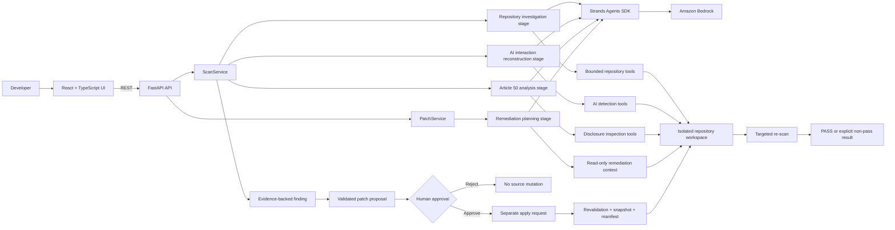
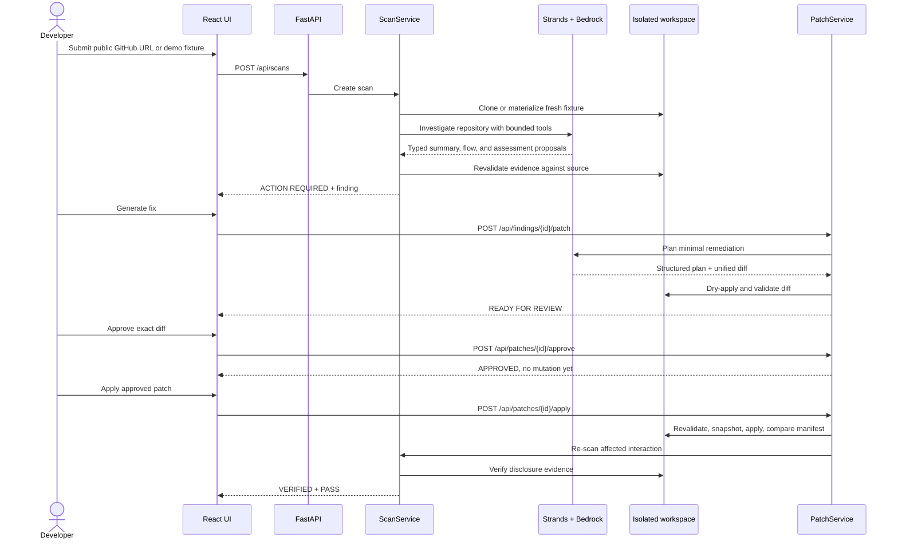

# Architecture

Article 50 AutoDisclosure combines bounded agent reasoning with deterministic safety controls. The
FastAPI service owns the workflow and trust boundaries; Strands stages investigate repository context
and return typed proposals, while application services validate every source fact and mutation.

## System view



The four reasoning stages are sequential responsibilities inside one controlled workflow. They do not
form an independent collaborating multi-agent system. Each stage uses the same centrally configured
Bedrock model and receives only the tools needed for its task.

## End-to-end workflow



## Agent reasoning

The Strands Agents SDK is used where the system must interpret relationships across an unfamiliar code
base:

- summarize repository architecture and important source paths;
- investigate likely AI integrations beyond manifest presence;
- reconstruct the user-facing path from UI caller to route, handler, provider, and model;
- reason over a bounded shortlist of likely rendered disclosure text;
- plan a minimal remediation for one verified frontend entrypoint.

Every stage returns Pydantic structured output. The Bedrock integration is centralized in
`backend/app/core/bedrock.py`; it configures `BedrockModel` with the selected model ID, region, and a low
temperature. boto3 resolves credentials through its standard provider chain.

Default model configuration:

```env
AWS_REGION=us-east-1
BEDROCK_MODEL_ID=global.anthropic.claude-sonnet-4-6
```

## Deterministic safety tools

Agent reasoning never authorizes a source mutation on its own. Deterministic code owns:

- strict public GitHub HTTPS URL validation;
- isolated workspace creation and path containment;
- clone limits and bounded UTF-8 source access;
- canonical file, line, snippet, and evidence-type validation;
- the minimum evidence required for a confirmed user-facing interaction;
- disclosure candidate extraction from likely rendered UI text;
- readiness result guardrails;
- allowed target files, unified-diff parsing, dry application, and line limits;
- patch lifecycle transitions and mandatory human approval;
- stale-source, binary-file, traversal, symlink, and `.git` protection;
- snapshots, repository-wide before/after manifests, rollback, and replay protection;
- targeted post-application verification.

This design lets the model interpret code while keeping filesystem authority narrow and auditable.

## Repository investigation boundary

Live scans accept only public `https://github.com/{owner}/{repository}` URLs. The clone is shallow and
uses no tags or submodules; interactive prompts, credential helpers, and LFS smudging are disabled.
Repository size is checked after cloning.

The model has no shell. Its repository tools can discover structure, list a bounded directory, read a
bounded text file, and perform bounded literal search. Shared rules exclude Git metadata, dependencies,
build output, caches, and editor directories. Every path is resolved beneath the backend-created
repository root.

The controlled demo bypasses network cloning only. It materializes a fresh local fixture in the same
workspace shape and then uses the real scan, patch, and verification services with deterministic model
responses.

## Evidence boundary

Model-proposed code evidence is not trusted as a fact. `EvidenceService` reopens the repository-relative
file, verifies the proposed line and exact snippet, and emits canonical source content. Unsupported or
fabricated evidence is discarded.

An installed AI dependency is only a signal. A confirmed direct interaction requires evidence for:

1. a user-facing client caller;
2. the corresponding API route;
3. a backend handler or service link;
4. an actual model invocation.

Incomplete or background-only usage remains an AI usage signal and does not become an invented
user-facing flow.

## Article 50 readiness boundary

The MVP implements one rule, `ARTICLE_50_1_AI_INTERACTION_DISCLOSURE`, referencing Regulation (EU)
2024/1689, Article 50(1). It does not perform a general EU AI Act audit or automate legal exceptions.

Disclosure inspection starts from the reconstructed frontend entrypoint. It follows bounded relative UI
imports, direct parent components, and easily discoverable translations. Likely rendered JSX text,
rendered constants, and user-visible attributes may become candidates. README text, comments, backend
logs, dependency names, and unrendered variables cannot establish a pass.

After Strands reasons over the candidates, the validator determines the public result:

- `PASS`: explicit, relevant, validated UI disclosure evidence exists;
- `ACTION_REQUIRED`: a complete direct interaction exists and the bounded UI scope has no candidate;
- `NEEDS_REVIEW`: the interaction, text, or visibility remains ambiguous.

Confidence describes evidence completeness, not the probability of legal compliance.

## Human approval and mutation boundary

Remediation is available only for an `ACTION_REQUIRED` finding tied to the implemented rule and a
verified frontend entrypoint. The remediation stage sees bounded excerpts from the captured source
snapshot through one read-only context tool.

Before a proposal reaches the UI, `UnifiedDiffValidator` requires one existing captured frontend file,
safe repository-relative paths, matching hunks, a bounded line count, and an added explicit disclosure
that appears to be rendered UI text. It dry-applies the diff in memory.

The lifecycle is deliberately split:

```text
READY_FOR_REVIEW → APPROVED → APPLYING → APPLIED → VERIFIED
                 ↘ REJECTED                 ↘ explicit verification failure/review
```

Approval records a human decision but performs no write. A separate apply request repeats every path,
allowlist, diff, size, binary, snapshot-integrity, and current-source check. It copies affected files to
`workspace/{scan_id}/snapshots/{patch_id}` before mutation. A repository-wide hash manifest must show
that exactly the approved files changed; otherwise the snapshot is restored. Applied and verified
proposals cannot be replayed.

Verification reuses the Article 50 analysis boundary for the original interaction. Only
`ACTION_REQUIRED → PASS` resolves the finding and marks the patch `VERIFIED`. Any remaining or ambiguous
gap is reported explicitly rather than being presented as success.

## Runtime state and API

FastAPI exposes:

- `GET /api/health`
- `POST /api/scans` and `GET /api/scans/{scan_id}`
- `POST /api/findings/{finding_id}/patch`
- `GET /api/patches/{patch_id}`
- `POST /api/patches/{patch_id}/approve`
- `POST /api/patches/{patch_id}/reject`
- `POST /api/patches/{patch_id}/apply`
- `GET /api/patches/{patch_id}/verification`

Interactive OpenAPI documentation is available at `/docs` while the backend runs. Scan and patch state
is currently stored in process memory; it is not an authentication or multi-tenant production service.

## Deliberate non-goals

The hackathon release does not add authentication, private repository access, arbitrary repository code
execution, Git commits or pushes, pull-request creation, persistent workflow storage, GDPR auditing, or a
full EU AI Act assessment. AgentCore remains a future deployment option rather than a last-minute runtime
dependency.
